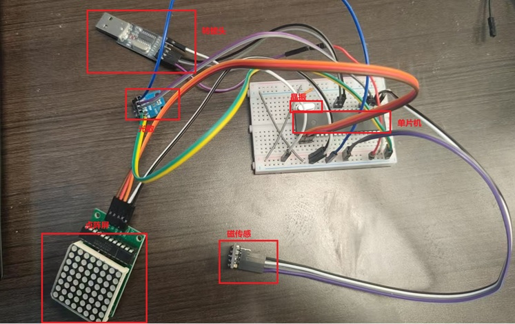
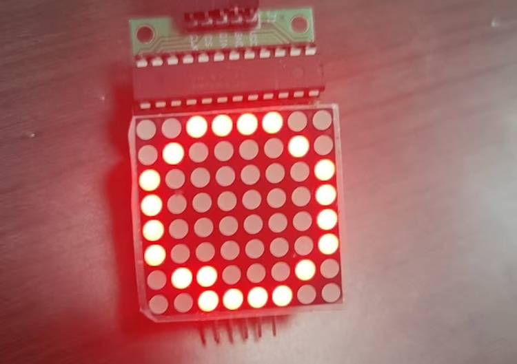
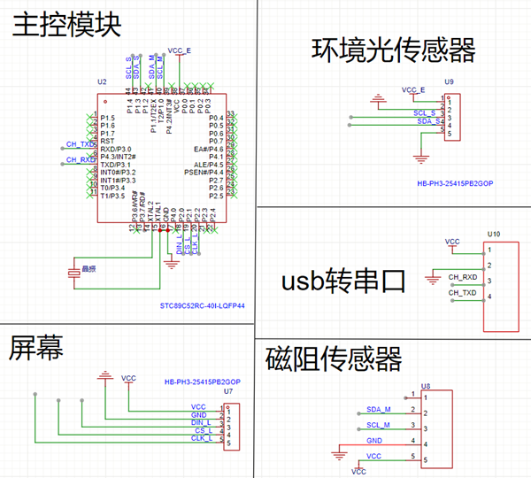
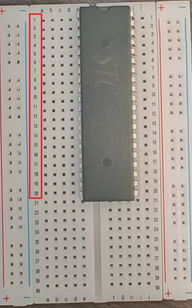
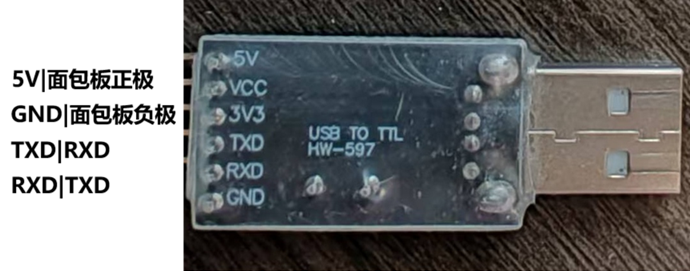
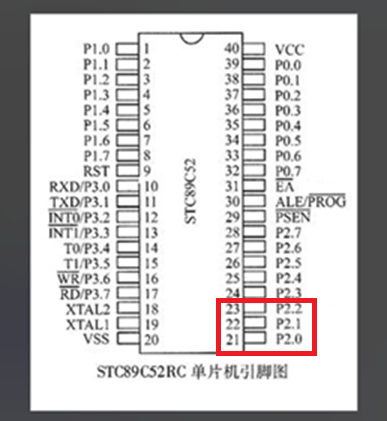
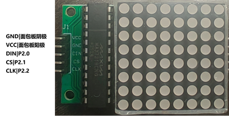
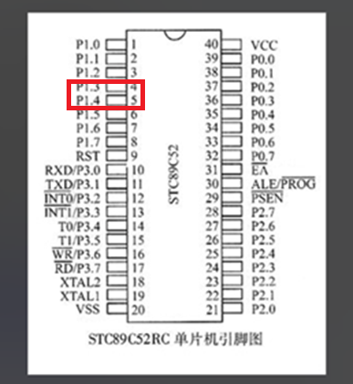
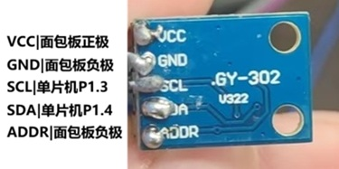

# 低功耗指南针制作教程

>
---

## 目录

* [一、项目介绍](#一项目介绍)
* [二、材料清单](#二材料清单)
* [三、前驱知识——元器件介绍](#三前驱知识元器件介绍)
    * [1. 晶振](#1晶振)
    * [2. 磁传感器](#2磁传感器)
    * [3. 点阵屏](#3点阵屏)
    * [4. 光敏模组](#4光敏模组)
    * [5. 杜邦线与面包板](#5杜邦线与面包板)
    * [6. USB转TTL转换头](#6usb转ttl转换头)
    * [7. 单片机](#7单片机)
    * [8. STC-ISP烧录软件](#8stc-isp烧录软件)
* [四、硬件的安装与检测](#四硬件的安装与检测)
    * [1. 底座搭建与单片机连接](#1底座搭建与单片机连接)
    * [2. 程序烧录方法与初步检测](#2程序烧录方法与初步检测)
    * [3. 点阵屏的安装与检测](#3点阵屏的安装与检测)
    * [4. 磁传感模块的安装与检测](#4磁传感模块的安装与检测)
    * [5. 光敏模块的安装与检测](#5光敏模块的安装与检测)
* [五、程序烧录与最终调试](#五程序烧录与最终调试)
* [六、完成与总结](#六完成与总结)

## 一、项目介绍

本教程旨在教会你完成一个简单的的电子指南针。它通过磁传感器模块检测地球磁场并计算方向发送给51单片机，再由51单片机将角度与方位信息画在点阵屏幕上。同时，有一个光敏芯片会实时检测外界光强，并根据外界光强调整屏幕亮度。

  
/*这是最终成果图，主要元器件包括：51单片机，点阵屏，磁传感器模块，光敏模块，晶振，USB-TTL转换头*/

  
/*一共16个点位分布于圆圈内测，上下左右各4个点，每个点代表22.5度*/

 
/*这是整个低功耗指南针的电路图*/

## 二、材料清单：

指南针元器件请参考

[低功耗指南针插线板版本材料清单](./材料插线板.md)。

测试代码与最终代码如下表，请先下载到自己电脑中

[软件目录](./程序插线板.md)。

## 三、软硬件介绍与准备：

### 1.晶振

晶振内置石英晶体片，利用其独特的压电效应工作，它会周期性振动，振动最终被转换为设备运行所需的、频率高度稳定的电信号。

### 2.传感器

磁力计传感器是整个系统的‘感知核心’。它如同项目的‘眼睛’，负责实时检测地球磁场的方向和强度，并将这些物理量转换为微弱的电信号，为后续计算方位提供最原始的数据基础。它主要提供X，Y，Z三个维度的数据。

### 3.点阵屏

它将传感器采集并经由单片机处理后的地磁数据，​转换为直观、可视化的方向信息。本教程的代码将360度均分为了16个方位在点阵屏上展示显示。

### 4.杜邦线

杜邦线的端头有两种规格，公（尖）与母（孔），将元器件（杜邦线）的引脚尖端插入杜邦线（面包板）孔端即为连接。

### 5.转换头

USB转TTL转换头是一个小巧的电子适配器，它能将电脑USB接口的信号转换为单片机等嵌入式设备能识别的TTL电平串口信号，充当两者之间的通信桥梁

### 6.面包板

面包板分为电源区与主工作区（如左图），主工作区分左右两半互不相连，但每半扇工作区的每排引脚孔相连（如右图中红框选中的引脚孔，是横向相连的一组）。当不同元器件通过杜邦线插入同一半工作区的同一排引脚孔，视为相连。即：工作区横向相连，电源区纵向相连。  
    

### 6.光敏模组

光敏模组通过光敏电阻接收外界光强度，将光强数据其交给单片机后，单片机会根据外界光强调整指南针屏幕的亮度

### 7.单片机

单片机通过面包板与其余元器件相连接，此处介绍单片机引脚，以下是单片机的引脚示意图，用于后续单片机与其他元器件引脚连接时对照。左图是示意图，右图为实物图，注意半圆缺口方向向上。

  

### 8.stc-isp软件

将代码烧录到单片机需要用到的软件，可以官网下载。

---

## 四、硬件的安装与检测

### 1.底座

#### （1）底座的安装

将单片机放置于面板板上，引脚插入面包板的引脚孔中，位置尽量居中

用两根杜邦线（公对公，或者用跳线）将左右的正级与正极，负极与负极相连（连接左右的电源区）。如红线所示

同上，连接单片机的VCC引脚与电源区正极、单片机VSS引脚与电源区负极

 

晶振两个引脚没有方向区分，分别连接单片机的XTAL1、XTAL2引脚即可，此处无需使用杜邦线。以下是引脚连接表与实物示例图：

#### （2）连接转换头

TXD引脚负责输出数据，RXD引脚负责输入数据，故应将转换头的TXD与单片机RXD，转换头RXD与单片机TXD相连。以下是引脚连接表与示例图：

 |转换器引脚|单片机引脚/面包板|  
 |:---:|:---:|  
 VCC|面包板正极  
 GND|面包板负极  
 TXD|RXD  
 RXD|TXD  

### 2.硬件检测手段——程序烧录

底座安装完后，就可以进行测试了，测试主要通过软件的手段进行，因此这里先介绍如何烧录软件。

(1) 点击stc软件，弹框直接点确定。此时将单片机上的转换器插入电脑USB接口。

(2) 点击stc界面中的单片机型号，在列表中找到STC89C52RC/LE52RC（选择自己单片机的型号，此处仅为展示），软件会自动选择串口号。如果未识别串口号，可能是缺少驱动，去官网下载CH341SER.EXE驱动。

(3) 点击红框中的“打开程序文件”。

(4) 选择之前下载的代码中的“测试单片机代码”，然后点击打开。

(5) 点击下载。注意，单片机需要冷启动，将转换器的正极电源线从面包板上拔下再插入，然后程序才会开始烧录。

(6) 如果一直在查找单片机，请检查单片机型号与串口号是否正确，单片机是否冷启动

(7) 右下角如图所示代表程序烧录成功，此时证明底座与单片机没问题。

### 3.点阵屏

#### （1）点阵屏安装

此处将点阵屏背面的引脚通过面包板与单片机对应引脚相连，以下是引脚连接表与示例图：

|显示器引脚|单片机引脚/面包板|
|:---:|:---:|
GND|面包板阴极
VCC|面包板阳极
DIN|P2.0
CS|P2.1
CLK|P2.2

#### （2）点阵屏检测

烧录软件目录中的“点阵屏检测程序”。
请验证无误后继续下一步。

### 4.磁传感模块

#### （1）磁传感模块安装

我们仅用到传感器上的VCC（电源），GND（地线），SCL（串行时钟线），SDA（串行数据线）这四个引脚。以下是引脚连接表与示例图（表中展示的同一行的两个引脚应该相连）：

|传感器引脚|单片机引脚/面包板|
|:---:|:---:|
VCC|面包板正极
GND|面包板负极
SCL|单片机P1.0
SDA|单片机P1.1

#### （2）磁传感模块检测

烧录软件目录中的“磁传感检测程序”。
这个程序的作用是当磁传感器传入数据恒为0时，屏幕显示数字0（此时说明出现了故障）。磁传感器稳定时，传入的磁数据波动不超过10度时，屏幕显示数字1。磁传感器数据变化大于10度时，屏幕显示数字2。请验证无误后继续下一步。

### 5.光敏模块

#### （1）光敏模块安装

以下是引脚连接表与示例图：

|传感器引脚|单片机引脚/面包板|
|:---:|:---:|
VCC|面包板正极
GND|面包板负极
SCL|单片机P1.3
SDA|单片机P1.4
ADDR|面包板负极

#### （2）光敏模块检测

烧录软件目录中的“光敏检测程序”。
这个程序的作用是当光敏传感器传入数据恒为0时，屏幕显示数字0（此时说明出现了故障）。光敏传感器稳定时，传入的光敏数据波动不超过10lux时，屏幕显示数字1。光敏传感器传入数据超过10lux时，屏幕显示数字2。请验证无误后继续下一步。

---

## 五、程序烧录与现象

> ## 至此，一个低功耗指南针就已经制作完成了。动手实践是最好的学习，期待看到你用它创造出更多有趣的应用。

