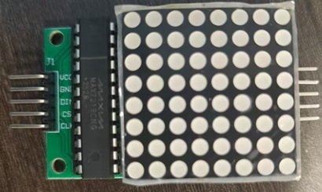
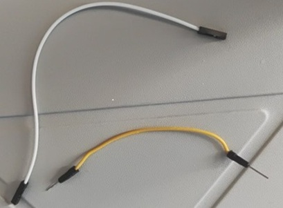

|元器件|规格|数量| |
|:---|:---:|---:|:---:|
单片机|SRC89C52RC|一个||
MAX7219点阵屏|MAX7219点阵屏模块|一块||
数字罗盘传感模块|HW-246/GY-271 芯片QMC358883L|一个||
杜邦线|10cm|二十根公对母，四根公对公/或者二十五根公对公和二十根母对母||
面包板|400孔|一个||
USB to TTL转换头|HW-597|一个||
晶振|11.05SCA|一个||
光敏模块|BH1750模块|一个||

